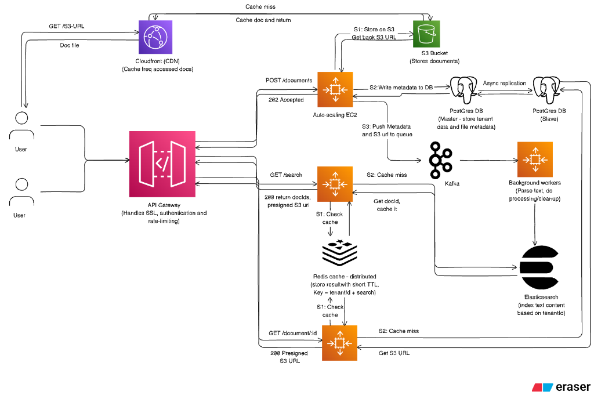

Searching across millions of heterogeneous documents while enforcing strict tenant isolation and achieving low latency is a classic distributed systems challenge. When building this **Distributed Document Search Service**, my primary objective was to deliver reliable multi-tenant full-text search with a **sub-500ms 95th percentile response time**, while shielding the search query path from heavy document ingestion workloads.

> [!note] Technical Assumptions
>
> **Search Engine Choice**: This system leverages **Elasticsearch** for text data indexing and retrieval as an industry standard. **OpenSearch** serves as a plug-and-play drop-in alternative.  
>

---

# Architecture Overview

They say a picture says a thousand words. Here is the complete architecture diagram outlining the end-to-end decoupling between ingestion, indexing, search, and storage layers:



---

# Core Components Breakdown

The system breaks down into modular, independently scalable services:

- **API Gateway**: A fully managed entry point that handles SSL termination, client authentication, tenant identification, and rate-limiting to protect downstream microservices.
- **Auto Scaling Group (EC2)**: Application server cluster divided into specialized microservices (`POST /documents`, `GET /search`, `GET /document/:id`). Each cluster scales compute capacity independently based on CPU and memory utilization.
- **S3 Bucket**: Scalable object store holding raw document files with time-bound presigned URL access controls.
- **PostgreSQL Database**: Serves as the single source of truth for user metadata, tenant profiles, and document metadata. Configured with Master-Slave replication for read offloading and high availability.
- **Apache Kafka**: Distributed event streaming platform acting as a buffer for asynchronous document processing, protecting workers during traffic spikes.
- **Background Workers**: Consumer nodes that fetch documents from S3, extract full text, clean payloads, and dispatch bulk write operations to Elasticsearch.
- **Elasticsearch Cluster**: Dedicated full-text engine providing sharded document storage and sub-second query retrieval isolated by `tenantId`.
- **Redis Cache**: In-memory distributed cache storing composite search queries (`tenantId + search_query`) and document metadata with short TTLs (1–5 minutes) to ensure sub-500ms 95th percentile query performance.
- **CloudFront (CDN)**: Content delivery network edge cache serving heavy static documents and streaming raw file downloads directly to users.

---

# System Data Flows

## 1. Document Indexing (`POST /documents`)

This ingestion flow utilizes an asynchronous, event-driven pattern to ensure API responsiveness even during massive bulk file uploads.

```
Client ──► API Gateway ──► EC2 App ──► S3 (Store Raw File)
                                │
                                ├──► PostgreSQL Master (Metadata)
                                │
                                └──► Kafka Topic ──► Background Worker ──► Elasticsearch
```

1. **Client Request**: The client sends the raw document binary along with `tenantId` metadata.
2. **API Gateway**: Validates authentication, enforces tenant-level rate limits, and terminates SSL.
3. **App Routing**: Passes payload to an available EC2 ingestion instance.
4. **Storage & Metadata Persistence**:
   - **S1**: The app server uploads the raw file to **S3** and receives a canonical object URL.
   - **S2**: Document metadata (file name, S3 URL, upload timestamp, tenant ID) is written to the **PostgreSQL Master**, which asynchronously replicates to Slave nodes.
5. **Event Queuing**: An indexing event containing document metadata and the S3 URL is pushed onto a Kafka topic.
6. **Immediate Acknowledgement**: The API returns `202 Accepted` to the client in under 15ms, completely decoupling ingestion from indexing.
7. **Background Processing**: Asynchronous consumer workers pull events from Kafka, fetch the file from S3, extract and normalize text tokens, and index the document into Elasticsearch with tenant routing.

---

## 2. Document Search (`GET /search`)

Optimized for **sub-500ms p95/p99 query latency** using multi-tiered caching and tenant-isolated routing.

1. **Client Request**: User initiates a search with a text query and `tenantId`.
2. **API Gateway**: Performs auth checks and rate limiting before forwarding to the Search App cluster.
3. **Cache Verification**: The app server checks Redis using a composite key: `redisKey = hash(tenantId + ":" + query)`.
4. **Cache Hit**: If present and TTL is valid, Redis returns cached `docIds` instantly.
5. **Cache Miss & Execution**: The server queries Elasticsearch, targeting specific tenant shards to fetch matching `docIds`.
6. **Response Generation & Caching**:
   - The returned `docIds` are cached in Redis with a short TTL (1–5 minutes).
   - Time-bound **Presigned S3 URLs** are generated for the matching documents.
   - API returns `200 OK` with search results, snippets, and download links.

---

## 3. Document Retrieval (`GET /document/:id`)

Offloads bandwidth-heavy file downloads from application servers directly to AWS CloudFront CDN edges.

1. **Metadata Request**: The client requests document details or a direct download link.
2. **Cache Verification**: The application server checks Redis for cached document metadata.
3. **Database Query**: On cache miss, queries the PostgreSQL Slave replica for the document's S3 path.
4. **URL Delivery**: API returns a `200 OK` containing a time-bound Presigned S3 URL.
5. **CDN Routing & Edge Caching**: CloudFront intercepts the user's download request via the presigned URL, serving the document from edge memory or streaming it directly from S3.

---

## 4. Document Deletion (`DELETE /documents/:id`)

To ensure data integrity without complicating the primary flow, deletion executes standard synchronous cleanup across all storage tiers:

1. **Client Request**: Admin/User issues a deletion request with document ID and tenant credentials.
2. **Storage Cleanup**:
   - **S1**: Deletes raw file from the S3 Bucket using the S3 object URL.
   - **S2**: Removes document metadata record from PostgreSQL.
   - **S3**: Issues a delete request to Elasticsearch to remove indexed document tokens.
3. **Acknowledgement**: Returns `204 No Content` upon successful cleanup.

---

# Implementation Deep Dive

### Multi-Tenant Index Routing in Elasticsearch

To guarantee strict tenant isolation and cut down cross-node scatter-gather overhead, every query explicitly passes the `tenantId` as a routing key:

```typescript
import { Client } from "@elastic/elasticsearch";

interface SearchParams {
  tenantId: string;
  queryText: string;
  page?: number;
  pageSize?: number;
}

export async function searchTenantDocuments(
  esClient: Client,
  params: SearchParams
) {
  const { tenantId, queryText, page = 1, pageSize = 20 } = params;

  return await esClient.search({
    index: "documents-v1",
    routing: tenantId, // Directs query execution specifically to tenant shards
    query: {
      bool: {
        filter: [
          { term: { tenant_id: tenantId } },
          { term: { is_deleted: false } }
        ],
        must: [
          {
            multi_match: {
              query: queryText,
              fields: ["title^3", "content", "tags^2"],
              fuzziness: "AUTO"
            }
          }
        ]
      }
    },
    highlight: {
      fields: {
        content: { fragment_size: 150, number_of_fragments: 3 }
      }
    },
    from: (page - 1) * pageSize,
    size: pageSize
  });
}
```

### Micro-Batched Kafka Consumer Worker

Worker processes aggregate incoming Kafka messages into micro-batches before issuing bulk index calls to Elasticsearch to minimize network overhead and disk I/O:

```typescript
import { EachBatchPayload } from "kafkajs";
import { Client as ElasticClient } from "@elastic/elasticsearch";

export async function processIndexingBatch(
  { batch, resolveOffset, heartbeat }: EachBatchPayload,
  esClient: ElasticClient
) {
  const operations = [];

  for (const message of batch.messages) {
    if (!message.value) continue;
    const doc = JSON.parse(message.value.toString());

    operations.push(
      { index: { _index: "documents-v1", _id: doc.id, routing: doc.tenantId } },
      {
        id: doc.id,
        tenant_id: doc.tenantId,
        title: doc.title,
        content: doc.extractedText,
        s3_url: doc.s3Url,
        created_at: doc.createdAt
      }
    );
  }

  if (operations.length > 0) {
    const { errors, items } = await esClient.bulk({ operations });
    if (errors) {
      console.error("Elasticsearch bulk indexing errors encountered", items);
    }
  }

  // Commit offsets only after bulk write is confirmed by ES
  resolveOffset(batch.messages[batch.messages.length - 1].offset);
  await heartbeat();
}
```

---

# Architectural Trade-Offs

<blockquote class="pullquote">
  <p>Tradeoff: Availability is preferred over strong consistency; this enables linear scalability and sub-second search latencies under heavy write load.</p>
  <cite>System Architecture Design Choice</cite>
</blockquote>

| Design Decision | Trade-off Made | Rationale & Mitigation |
| :--- | :--- | :--- |
| **Eventual Consistency** | Indexing delay of 1–3s before uploaded files appear in search | Enables massive ingestion throughput via Kafka micro-batching; NRT is ideal for document search. |
| **Tenant Routing Keys** | Potential shard skew if one tenant grows disproportionately | Tiering: Enterprise tenants receive dedicated indices, while SMB tenants share routed index shards. |
| **Short TTL Redis Caching** | Brief stale cache windows on document updates | Document edits trigger Redis key invalidation events over Pub/Sub, restoring freshness instantly. |
| **Relational Metadata** | PostgreSQL master write bottleneck at massive scale | Active slave read replicas handle queries; sharding or Cassandra migration path ready for future growth. |

---

# Production Readiness Analysis

Building a production-ready distributed service requires rigorous attention to resilience, security, and operations:

### 1. Scalability
Every individual tier is independently scalable. Compute nodes sit in EC2 Auto Scaling groups. Elasticsearch scales horizontally by adding node shards. PostgreSQL offloads reads to slave replicas, and S3/CloudFront handle arbitrary storage and download growth.

### 2. Resilience & Error Handling
Kafka guarantees message persistence during worker or broker outages. Ingestion retry loops use **exponential backoff**. Messages that fail repeatedly are diverted to a **Dead Letter Queue (DLQ)** for manual analysis and replay.

### 3. Security
- Centralized auth & tenant validation at the API Gateway prevents unauthorized request execution.
- File downloads use time-bound, cryptographically signed **Presigned S3 URLs**, preventing direct bucket exposure.

### 4. Observability
Centralized **Grafana** dashboard monitoring the full stack:
- **Prometheus**: Cluster health metrics, CPU/memory, Kafka lag, query latency histograms.
- **Loki**: Centralized log collection across EC2 nodes and consumer workers.
- **Tempo**: End-to-end distributed tracing across Gateway -> Kafka -> ES.

### 5. Performance
Using specialized full-text indexing in Elasticsearch instead of SQL queries, coupled with multi-level Redis caching, maintains a **sub-500ms 95th percentile response time**.

### 6. Operations & Deployments
Zero-downtime **Blue-Green Deployment** strategy. Docker containers configured with restart policies (`always-restart`), rollout order (`start-first`), and parallel execution flags.

### 7. SLA Guarantee
Using managed AWS API Gateway, redundant multi-AZ compute, and Postgres slave failover ensures a target **99.99% system availability SLA**.

